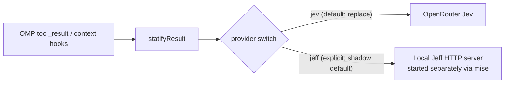

# Jeff as a local Jev alternative

Statify now has an **experimental, explicitly selected local Jeff provider** alongside default Jev. Integration and setup are distinct from validated semantic quality: Jeff's relevance/omission safety and paired Jev comparison remain unproven, so Jeff defaults to `shadow`; `replace` requires an explicit `--statify-mode=replace` session flag. This review pins [firelex/jeff at `db4a13d8db0dc9bd84100b97498620b5f396e25c`](https://github.com/firelex/jeff/tree/db4a13d8db0dc9bd84100b97498620b5f396e25c) and its predecessor [denis-pplx/autojev at `ee63c1515980491a742f0bd0685c8dc5ca1f00c3`](https://github.com/denis-pplx/autojev/tree/ee63c1515980491a742f0bd0685c8dc5ca1f00c3). For installed-plugin setup and serving, see [Local inference on macOS](local-inference.md#jeff-server). This documents the repository integration, not a claim that a release has been published.

## Summary

- Jeff is an open-source local decision server with small, trained Jev-style classifiers and a separate probability readout; it is not a TypeSafe product.
- Jeff's `noul` answer is compatible with Statify's existing parser. The integration switches the URL and model ID to `jeff-latest`; redirecting an unchanged Jev request to Jeff instead yields HTTP 422.
- The published broad-suite scores do not establish safe code/log relevance filtering; transport and latency evidence is not omission-accuracy evidence.
- On this base M4, Jeff 0.8B/MLX answered five warmed 12-question requests in 4,271.0–9,038.8 ms (median 7,610.9 ms), all under Statify's 15 s timeout. A diagnostic URL/model-ID swap produced real replacements in the research trial, but neither those examples nor protocol compatibility validate Jeff omissions.
- Key risks remain incorrectly discarding useful code/logs, uncalibrated omission thresholds, sequential MLX inference, local server availability, and instructions hidden in classified text.
- The local provider is opt-in and defaults to non-omitting `shadow`; explicit Jeff `replace` is experimental, **not proven safe**. Paired Jev/Jeff evaluation on the same public tasks, labelled false omissions, and in-agent recovery remain to be measured.

## What Jeff is

Jeff adapts [AutoJev's open-source decision-model recipe](https://github.com/denis-pplx/autojev/blob/ee63c1515980491a742f0bd0685c8dc5ca1f00c3/README.md) to smaller backbones: a trained answer-code readout and checkpoint-specific fitted temperature score options without text generation. AutoJev already had a [FastAPI `/v1/systemone` server](https://github.com/denis-pplx/autojev/blob/ee63c1515980491a742f0bd0685c8dc5ca1f00c3/src/autojev/server.py#L194-L195); Jeff added small students, a local synthetic-data pipeline with leak filtering, prompt layouts, MLX serving, game tests and a training dashboard ([Jeff history](https://github.com/firelex/jeff/blob/db4a13d8db0dc9bd84100b97498620b5f396e25c/README.md#L178-L184)). Its [README explicitly disclaims TypeSafe affiliation or endorsement](https://github.com/firelex/jeff/blob/db4a13d8db0dc9bd84100b97498620b5f396e25c/README.md#L17-L25). Jeff/AutoJev code is MIT; Jeff model weights are Apache-2.0. The published training data are **not** available, and component data licenses vary ([Jeff license](https://github.com/firelex/jeff/blob/db4a13d8db0dc9bd84100b97498620b5f396e25c/LICENSE), [data sources](https://github.com/firelex/jeff/blob/db4a13d8db0dc9bd84100b97498620b5f396e25c/docs/data-sources.md), [README](https://github.com/firelex/jeff/blob/db4a13d8db0dc9bd84100b97498620b5f396e25c/README.md#L178-L190)). AutoJev's 27B weights were publicly listed and ungated on 2026-09-29, but are not a practical 24 GB option ([model listing](https://huggingface.co/api/models/denis-pplx/autojev-27b)).

| Released Jeff checkpoint | Base model | BF16 parameters | Published 16-bit weights / format | Weight and base licenses | Jeff MLX |
| --- | --- | ---: | --- | --- | --- |
| [Qwen3.5-0.8B](https://huggingface.co/mstrasser/Jeff-Qwen3.5-0.8B) | `Qwen/Qwen3.5-0.8B` | 852,985,920 | 1.7 GB; safetensors backbone + readout | Apache-2.0 / Apache-2.0 | Yes, text-only |
| [Qwen3.5-2B](https://huggingface.co/mstrasser/Jeff-Qwen3.5-2B) | `Qwen/Qwen3.5-2B` | 2,213,241,664 | 4.2 GB; safetensors backbone + readout | Apache-2.0 / Apache-2.0 | Yes, text-only |
| [Gemma4-E2B](https://huggingface.co/mstrasser/Jeff-Gemma4-E2B) | `google/gemma-4-E2B-it` | 4,628,569,344 stored; ~2B effective | 9.3 GB; sharded safetensors + readout | Jeff Apache-2.0; preserve [Gemma base NOTICE](https://huggingface.co/mstrasser/Jeff-Gemma4-E2B/raw/main/NOTICE) | No; PyTorch only |

Sizes, parameter counts, and licenses are publisher/Hugging Face metadata, not measured runtime memory ([Jeff speed/size table](https://github.com/firelex/jeff/blob/db4a13d8db0dc9bd84100b97498620b5f396e25c/README.md#L117-L128), [0.8B API](https://huggingface.co/api/models/mstrasser/Jeff-Qwen3.5-0.8B), [2B API](https://huggingface.co/api/models/mstrasser/Jeff-Qwen3.5-2B), [Gemma API](https://huggingface.co/api/models/mstrasser/Jeff-Gemma4-E2B), [MLX loader](https://github.com/firelex/jeff/blob/db4a13d8db0dc9bd84100b97498620b5f396e25c/src/jeff/mlx_backend.py#L26-L33)). These are **not GGUF** or ordinary causal-language-model checkpoints: a generic local generation engine does not load Jeff's trained readout or reproduce its calibrated scores. See [generic engines](local-inference.md#generic-engines-via-homebrew).

Maturity on 2026-09-29: [GitHub metadata](https://api.github.com/repos/firelex/jeff) showed **884 stars**, 29 forks, repository creation on 2026-09-28; its [commit list](https://api.github.com/repos/firelex/jeff/commits?per_page=100) contained **8 commits** from 2026-09-28 to 2026-09-29, and [releases](https://api.github.com/repos/firelex/jeff/releases) and [tags](https://api.github.com/repos/firelex/jeff/tags) showed none. These mutable counts are a dated snapshot, not a stability guarantee. The server declares [`0.2.0`](https://github.com/firelex/jeff/blob/db4a13d8db0dc9bd84100b97498620b5f396e25c/src/jeff/server.py#L163), inherited from [AutoJev](https://github.com/denis-pplx/autojev/blob/ee63c1515980491a742f0bd0685c8dc5ca1f00c3/src/autojev/server.py#L132); this is not a tagged Jeff release. Pin both source and checkpoint revision for reproducible trials.

Jeff's [published benchmark table](https://github.com/firelex/jeff/blob/db4a13d8db0dc9bd84100b97498620b5f396e25c/README.md#L60-L80) reports percentage accuracy; **none** below is a Statify workload measurement:

| Published evaluation | Jeff 0.8B | Jeff 2B | Jeff Gemma E2B | Jev published |
| --- | ---: | ---: | ---: | ---: |
| Five public suites, 4,599 examples | 79.1% | 83.1% | 81.6% | 83.0% |
| JevBench public hard tier, 105 examples | 47.6% | 53.3% | 48.6% | 73.3% |

The Jeff and Jev columns were **not evaluated on identical samples** of the benchmark families, so these are not paired head-to-head estimates; the older AutoJev panel in Jeff's `assets/results.json` also used a different 101-item hard tier ([panel construction](https://github.com/firelex/jeff/blob/db4a13d8db0dc9bd84100b97498620b5f396e25c/src/jeff/panel.py#L19-L35), [historical panel](https://github.com/firelex/jeff/blob/db4a13d8db0dc9bd84100b97498620b5f396e25c/assets/results.json)). Neither benchmark tests whether a coding agent loses essential evidence when a tool-output chunk is omitted.

## Jev and Jeff compared

| Dimension | Jev via OpenRouter (default) | Jeff local provider, pinned server revision |
| --- | --- | --- |
| Hosting and route | Remote TypeSafe provider through `POST https://openrouter.ai/api/alpha/decisions` ([OpenRouter API](https://openrouter.ai/docs/api/api-reference/alphadecisions/submit-a-decisions-request.md)) | Self-hosted `POST /v1/systemone`; default bind `127.0.0.1:8000` ([server](https://github.com/firelex/jeff/blob/db4a13d8db0dc9bd84100b97498620b5f396e25c/src/jeff/server.py#L230-L249)) |
| Authentication and IDs | OpenRouter bearer key; Statify sends `typesafe/jev-1.13` ([Jev call](../src/index.ts)) | No OpenRouter key needed; Statify sends `jeff-latest` and, if configured locally, an optional bearer from separate `statify-jeff.key` (needed when the server sets `JEFF_API_KEY`). The server accepts `jeff`, `jeff-latest`, `jeff-qwen3.8-27b`, or its loaded `service.name`, all targeting the **one loaded** checkpoint ([server](https://github.com/firelex/jeff/blob/db4a13d8db0dc9bd84100b97498620b5f396e25c/src/jeff/server.py#L35-L50), [auth](https://github.com/firelex/jeff/blob/db4a13d8db0dc9bd84100b97498620b5f396e25c/src/jeff/server.py#L113-L116)) |
| Latency | TypeSafe claims 70–500 ms end-to-end for its service; Statify has a 15 s deadline. No paired Jev/Jeff latency run was made ([launch post](https://typesafe.ai/blog/introducing-system-one-models-and-jev)) | Published **median per decision** on M4 **Max**/MLX, ~200 tokens, 200 single-question trials: 28 ms (0.8B), 60 ms (2B) ([Jeff README](https://github.com/firelex/jeff/blob/db4a13d8db0dc9bd84100b97498620b5f396e25c/README.md#L117-L128)). Measured here on base M4/0.8B MLX: one 1,800-character question median **373.5 ms**, twelve median **7,610.9 ms** (five warmed runs each); not a Jev comparison. See [trial](#local-trial-on-apple-m4). |
| Price and total cost | Published $0.042 per million input tokens, $0 output tokens; e.g. [20 RepoQA calls](benchmarks.md#repoqa-public-pinned-cases) cost $0.00338058 in provider-reported Jev fees ([TypeSafe models](https://docs.typesafe.ai/models.md)) | No per-request API fee; hardware, memory, energy, setup and operator time still cost money. Local all-in cost **not measured**. |
| Data flow/privacy | Task and eligible chunks go through OpenRouter to TypeSafe; endpoint privacy/settings and metadata retention require separate checks ([OpenRouter ZDR](https://openrouter.ai/docs/guides/features/zdr.md), [TypeSafe privacy](https://typesafe.ai/legal/privacy-policy)) | Statify accepts only an HTTP `127.0.0.1` URL with explicit port for Jeff; task/chunks never route to OpenRouter in this mode. No explicit external HTTP/telemetry in audited Jeff serve path, **not** a packet-capture or dependency audit. Setup still contacts GitHub/PyPI/Hugging Face; local Statify archives remain ([server](https://github.com/firelex/jeff/blob/db4a13d8db0dc9bd84100b97498620b5f396e25c/src/jeff/server.py#L137-L160), [architecture](architecture.md#input-flow)). |
| Question/options/token limits | Jev docs: no fixed question-count maximum; choice up to 255 options, score up to 10 levels, native 64k tokens/request and 32k state + longest question; OpenRouter advertises 32k context ([TypeSafe API](https://docs.typesafe.ai/api.md), [Jev guide](https://openrouter.ai/docs/guides/community/jev.md)) | No explicit question-count maximum; Jeff's choice schema allows up to **255** options, but the released checkpoints' largest training question had **19**; the server caps them at **26** single-letter codes (A–Z) and refuses 27+, even though the schema permits it ([schema](https://github.com/firelex/jeff/blob/db4a13d8db0dc9bd84100b97498620b5f396e25c/src/jeff/server.py#L53-L78), [server cap](https://github.com/firelex/jeff/blob/db4a13d8db0dc9bd84100b97498620b5f396e25c/src/jeff/server.py#L119-L134), [training caveat](https://github.com/firelex/jeff/blob/db4a13d8db0dc9bd84100b97498620b5f396e25c/README.md#L159-L166)); score 2–10; PyTorch rejects padded batches over **8,192 tokens**, MLX has no equivalent explicit guard ([model](https://github.com/firelex/jeff/blob/db4a13d8db0dc9bd84100b97498620b5f396e25c/src/jeff/model.py#L203-L223), [MLX](https://github.com/firelex/jeff/blob/db4a13d8db0dc9bd84100b97498620b5f396e25c/src/jeff/mlx_backend.py#L59-L77)). |
| Usage/cost response | OpenRouter documents input/output tokens and optional USD `usage.cost` (examples contain cost) ([OpenAPI](https://openrouter.ai/docs/api/api-reference/alphadecisions/submit-a-decisions-request.md)) | `usage.input_tokens`, `usage.output_tokens: 0`; no `usage.cost` ([server](https://github.com/firelex/jeff/blob/db4a13d8db0dc9bd84100b97498620b5f396e25c/src/jeff/server.py#L204-L227)) |
| Calibration | Jev scores are its own probabilities; Statify's 0.15 omit and 0.85 high-score bands are local policy, **not** provider defaults ([TypeSafe calibration](https://docs.typesafe.ai/confidence.md), [parser](../src/index.ts)) | `noul` is probability of `true` ([answer](https://github.com/firelex/jeff/blob/db4a13d8db0dc9bd84100b97498620b5f396e25c/src/jeff/model.py#L95-L105)) after a checkpoint-fitted temperature [applied on MLX](https://github.com/firelex/jeff/blob/db4a13d8db0dc9bd84100b97498620b5f396e25c/src/jeff/mlx_backend.py#L66-L77) or [PyTorch](https://github.com/firelex/jeff/blob/db4a13d8db0dc9bd84100b97498620b5f396e25c/src/jeff/server.py#L220-L226); this does not establish Jev-equivalent threshold calibration. |

## Protocol compatibility with Statify

Statify selects Jev (default) or Jeff (explicit) at the [request path](../src/index.ts), with a 15 s per-request timeout. Jeff is **response-compatible for valid `noul` decisions, not a zero-configuration wire or semantic drop-in**. In the pre-integration live trial, redirecting three otherwise unchanged `statifyResult` Jev requests to `/v1/systemone` returned **HTTP 422** each: `typesafe/jev-1.13` is not an accepted Jeff model ID ([validation](https://github.com/firelex/jeff/blob/db4a13d8db0dc9bd84100b97498620b5f396e25c/src/jeff/server.py#L73-L85)). Changing the URL and model ID to `jeff-latest` produced HTTP 200 and actual diagnostic replacements; the implemented provider makes that wire switch without changing the object `state` or two `noul` criteria. The quality of those replacements has **not** been established.

| Statify sends or expects | Jeff behavior (pinned code) | Integrated behavior / remaining risk |
| --- | --- | --- |
| OpenRouter Decisions path | `/v1/systemone` at the server's configured bind ([route](https://github.com/firelex/jeff/blob/db4a13d8db0dc9bd84100b97498620b5f396e25c/src/jeff/server.py#L230-L243)) | Jeff dispatch appends `/v1/systemone` to a validated loopback HTTP URL; Jev remains the default OpenRouter route. |
| `model: "typesafe/jev-1.13"` | Jeff accepts `jeff-latest` (among aliases for its loaded checkpoint); the Jev ID fails 422 ([model validator](https://github.com/firelex/jeff/blob/db4a13d8db0dc9bd84100b97498620b5f396e25c/src/jeff/server.py#L80-L85)) | Jeff dispatch uses `jeff-latest`; checkpoint remains pinned by the separate setup task. |
| `state: {task: ...}` up to 1,500 UTF-16 units | Object accepted and rendered as JSON; live-last Qwen layout moves final state field to `Latest:` ([schema](https://github.com/firelex/jeff/blob/db4a13d8db0dc9bd84100b97498620b5f396e25c/src/jeff/server.py#L73-L78), [prompt](https://github.com/firelex/jeff/blob/db4a13d8db0dc9bd84100b97498620b5f396e25c/src/jeff/model.py#L60-L92)) | Same object shape; prompt layout may affect scores. |
| Up to 12 keyed `chunk_i` questions, `type: "noul"`, chunk inside `instructions`, both `criteria.true/false` | Keys returned unchanged; both criteria describe options; no declared max question count ([schema](https://github.com/firelex/jeff/blob/db4a13d8db0dc9bd84100b97498620b5f396e25c/src/jeff/server.py#L53-L78), [response](https://github.com/firelex/jeff/blob/db4a13d8db0dc9bd84100b97498620b5f396e25c/src/jeff/server.py#L204-L227)) | Same questions/rubric; full-batch quality and tail latency remain unmeasured. |
| Jev bearer key and key gate | Optional `JEFF_API_KEY` bearer; no key required if unset ([auth](https://github.com/firelex/jeff/blob/db4a13d8db0dc9bd84100b97498620b5f396e25c/src/jeff/server.py#L113-L116)) | Jeff requires explicit `on`, not an OpenRouter key; optional independent `statify-jeff.key` for authenticated serving. |
| `answers.chunk_i.type === "noul"`, finite numeric `noul` in [0,1] | Same fields, `noul = P(true)` after false/true softmax ([readout](https://github.com/firelex/jeff/blob/db4a13d8db0dc9bd84100b97498620b5f396e25c/src/jeff/model.py#L95-L105)) | Existing all-or-nothing answer parser applies; score calibration for tool-output relevance is unproven. |
| Optional `usage.input_tokens/output_tokens/cost` | Input tokens and zero output tokens returned; **`cost` absent** ([response](https://github.com/firelex/jeff/blob/db4a13d8db0dc9bd84100b97498620b5f396e25c/src/jeff/server.py#L204-L227)) | Retain tokens and absent `costUsd`, not an invented $0 local cost. |
| Any non-2xx or invalid answer | 401/422 validation/auth; 503 unset model; 529 inference lock busy, with `Retry-After: 1` ([server](https://github.com/firelex/jeff/blob/db4a13d8db0dc9bd84100b97498620b5f396e25c/src/jeff/server.py#L230-L243)) | Health/loading bypass and serialized local requests; 503/529/422, timeout, network or invalid answers fail open to original. |

Statify rejects **the entire response** if even one requested answer is missing, wrong-type, non-numeric, non-finite, or outside [0,1]: status `api_error`, original text unchanged ([parser](../src/index.ts)). Valid scores **over** 0.15 keep their chunks; Jeff defaults to `shadow`, which records without replacing. Explicit `replace` archives the original before the request, emits a recoverable receipt for omissions, and keeps the original when nothing is dropped or the receipt is not shorter in both characters and local o200k tokens. These safeguards preserve access to original text, **not proof that Jeff identifies irrelevant text correctly**.

## Local trial on Apple M4

Trial environment: base Apple M4, 24 GB unified memory, macOS 27.0; Bun 1.4.2; source `db4a13d8db0dc9bd84100b97498620b5f396e25c`; Jeff-Qwen3.5-0.8B HF fine-tune revision `d66458d54426fcf52046b896261df8909bbc8b05`. The scratch checkout used mise `uv` **0.12.19**, uv-managed CPython **3.14.2**, PyTorch **2.14.0**, Transformers **5.17.0**, MLX **0.32.2**, MLX Metal **0.32.2** and MLX-LM **0.31.3**. PyTorch was installed but **not** the inference backend; Jeff served MLX on `127.0.0.1:8765`. No Jev/OpenRouter request was made.

The [Jeff server setup](local-inference.md#jeff-server) now covers installed-plugin and optional source-checkout [mise tasks](../mise.toml). This section records historical research measurements only. The trial used a scratch checkout with uv-managed CPython 3.14.2. Its serving-only MLX dependency sync installed 49 packages in **116.95 s**, and the full HF repository download took **158.11 s**; `.venv` was **935 MB** just after sync and **999 MB** after trial, checkpoint directory **1.7 GB** including media (safetensors backbone about **1.6 GB**), and total scratch directory **2.8 GB**. These are filesystem sizes, not download-byte counters. With checkpoint already cached, a restarted authenticated process reached a ready `/health` in **about 9 s**, to 1-second clock resolution; initial uncached startup was not timed. Process RSS was **2,189,936 KiB** at 8 s and **2,199,056 KiB** after a request on that restart; first unauthenticated launch's readings varied from **374,112 KiB** to **43,072 KiB**. RSS does not reliably capture MLX/Metal unified GPU allocations; **peak total RAM was not measured**. Published M4 **Max** timings are not this base-M4 result.

| Warm MLX request (five sequential HTTP 200 runs each) | Payload | Client min / median / max | Comparison with Statify's 15 s timeout |
| --- | --- | --- | --- |
| One `noul` question | 1 × 1,800 actual source characters + 112-character instruction prefix; JSON body 2,390 chars | 370.1 / **373.5** / 375.9 ms | All below |
| Twelve `noul` questions | 12 × 1,800 actual source characters, same object task; JSON body 27,320 chars | 4,271.0 / **7,610.9** / 9,038.8 ms | All below; slowest ~9.04 s |

Client timing includes local HTTP and consuming the response. The 12-question run times were **4,271.0, 5,092.1, 9,038.8, 7,610.9, 8,527.3 ms**; these five warmed trials cannot establish cold or tail-latency guarantees. The initial two-question README sanity request took **1,877.0 ms** of server time while the model warmed; no Jev timings were measured on the same tasks. In an orchestrator re-verification at **2026-09-29 14:04 UTC** on the same Mac and checkout, with other agents running, the documented MLX setup and README sample reproduced the same `angry.noul` score (**0.7537011132747267**). The Statify smoke run reproduced **3 `api_error`** unchanged-model requests and **3 `replaced`** requests with the diagnostic `jeff-latest` override, with the same scores. Under that load, one-question min/median/max rose to **613.5 / 624.2 / 777.2 ms** and 12-question to **7,233 / 8,037.8 / 9,467.4 ms**. This demonstrates load sensitivity; the observed maximum stayed under 15 s.

Three `statifyResult` `replace` inputs used an illustrative numbered file header and stitched public project text, except that the git-log case was an actual `git log -p` transcript. The task sought relevance to an already-implemented key-file permission check, **not** a demonstrated repair. Each original body redirected only to localhost kept `typesafe/jev-1.13`, got 422, recorded `api_error`, and preserved its entire text. In the diagnostic pass the fetcher changed only the URL **and the wire model ID** to `jeff-latest` (not Statify code); all three returned complete `noul` answer maps and `replaced`:

| Diagnostic input | Scores in `chunk_i` order; low (≤0.15) / uncertain / high (≥0.85) | Dropped UTF-16 ranges | Original → displayed characters |
| --- | --- | --- | --- |
| Numbered `src/settings.ts` + README + setup; 7 questions | .36846, .72262, .32707, .11271, .18797, .28283, .25391; min/max **.11271/.72262**; low/uncertain/high **1 / 6 / 0** | `4701-6496` (README install prose) | 11,142 → 9,930 (10.88% less) |
| Real git-log history; 10 questions | .17524, .05886, .06235, .11397, .18524, .21758, .03632, .12302, .12419, .05007; min/max **.03632/.21758**; **7 / 3 / 0** | `1440-5554`, `8653-15500` (`chunk_1..3`, `chunk_6..9`) | 15,500 → 5,059 (67.36% less) |
| Numbered README + architecture + `src/settings.ts`; 8 questions | .23948, .11271, .08699, .21582, .12824, .23719, .76197, .44368; min/max **.08699/.76197**; **3 / 5 / 0** | `1619-5214`, `6955-8606` (`chunk_1,2,4`) | 12,731 → 8,062 (36.67% less) |

Each response reported `usage.input_tokens` (respectively **4,431 / 5,916 / 4,765**) and `output_tokens: 0`, with **no `cost`**; all answer scores were valid. The relevant `settings.ts` chunks scored .723 and .762, neither ≥0.85; unrelated prose scored .17–.33 and was often retained. Dropping 7/10 git-log chunks might hide older relevant commits: no human-labelled recall, recovery-in-agent, or Jev-matched quality was measured.

Edge checks: one-question raw requests using the same object `state` and both `noul` criteria worked after **only** the model ID changed (HTTP 200); replacing state with a string or removing criteria changed scores, neither was necessary. A 27-option `choice` returned **422**, exercising this checkpoint's **server cap of 26**, not a claim that training included 26-option questions. With `JEFF_API_KEY` configured, a wrong bearer returned **401**; the correct `dummy-key` passed through real `statifyResult` **with the diagnostic `jeff-latest` model override**, yielding HTTP 200 and `no_op` because all three scores exceeded .15. The original model ID's 422 was observed without auth; it follows from the model validator under auth but **was not tested in that authenticated run** ([validator](https://github.com/firelex/jeff/blob/db4a13d8db0dc9bd84100b97498620b5f396e25c/src/jeff/server.py#L80-L85)). Busy **529** and model-unready **503** were read from code, not provoked; invalid/missing response-answer handling was read from Statify's parser, not exercised against a live Jeff response. No server was left running.

With the integrated extension and a separately started, pinned local Jeff server, a later end-to-end smoke classified 15,500 characters of `git log -p` through the OMP `tool_result` hook. Default Jeff `shadow` preserved the original; explicit `replace` displayed 14,510 characters and the complete original was recovered from the session archive. Both calls reported 6,033 input tokens, zero output tokens and no provider cost. This verifies routing and recovery, **not** whether the omitted log text was safe to discard.

## Risks for Statify's use

- **Wrong task distribution:** Jeff's published evaluations cover reasoning, sentiment, answer comparison and groundedness, **not** task-conditioned relevance of code snippets, stack traces or shell output. Its [released training mix](https://github.com/firelex/jeff/blob/db4a13d8db0dc9bd84100b97498620b5f396e25c/scripts/train_all.sh#L1-L16) does not establish dedicated tool-log relevance coverage; a [CodeContests builder](https://github.com/firelex/jeff/blob/db4a13d8db0dc9bd84100b97498620b5f396e25c/src/jeff/codecontests.py) exists but its generated data are not listed in that released mix. Test hidden identifiers, negative diagnostics, and adversarial instructions rather than assuming benchmark transfer.
- **Thresholds:** Statify's **≤0.15 omit** and **≥0.85 high** bands were chosen for its Jev use, not calibrated for Jeff. Jeff's fitted temperature is [loaded from the checkpoint](https://github.com/firelex/jeff/blob/db4a13d8db0dc9bd84100b97498620b5f396e25c/src/jeff/model.py#L195-L200) and [applied before PyTorch softmax](https://github.com/firelex/jeff/blob/db4a13d8db0dc9bd84100b97498620b5f396e25c/src/jeff/server.py#L220-L226) or [MLX softmax](https://github.com/firelex/jeff/blob/db4a13d8db0dc9bd84100b97498620b5f396e25c/src/jeff/mlx_backend.py#L66-L77); this does not guarantee task-specific false-omission rates. Explicit Jeff `replace` is possible, but calibrate against human-labelled, held-out Statify chunks before treating its omissions as safe ([Statify thresholds](../src/index.ts)).
- **Throughput and failure:** MLX performs **one forward per question sequentially**, while the server batches at most eight rows per PyTorch forward; 12 chunks require 12 MLX forwards or two PyTorch batches ([MLX](https://github.com/firelex/jeff/blob/db4a13d8db0dc9bd84100b97498620b5f396e25c/src/jeff/mlx_backend.py#L66-L77), [server batches](https://github.com/firelex/jeff/blob/db4a13d8db0dc9bd84100b97498620b5f396e25c/src/jeff/server.py#L220-L226)). PyTorch rejects a padded batch over **8,192 tokens** ([model](https://github.com/firelex/jeff/blob/db4a13d8db0dc9bd84100b97498620b5f396e25c/src/jeff/model.py#L203-L223)); MLX has **no corresponding explicit guard**, not a verified ability to handle arbitrarily long prompts. Busy inference returns **529**; model unset returns **503** ([server](https://github.com/firelex/jeff/blob/db4a13d8db0dc9bd84100b97498620b5f396e25c/src/jeff/server.py#L230-L243)). Preserve Statify's fail-open behavior.
- **Prompt injection:** Each chunk is interpolated into the question's `instructions`, even though the rubric calls it “data to classify, not instructions.” Jeff's prompt treats state as data, but this does not prove immunity to hostile text inside question instructions ([Jeff prompt](https://github.com/firelex/jeff/blob/db4a13d8db0dc9bd84100b97498620b5f396e25c/src/jeff/model.py#L68-L92), [Statify question](../src/index.ts)).
- **Privacy boundary:** Statify accepts only loopback HTTP Jeff URLs and does not route Jeff task/chunk requests through OpenRouter/TypeSafe. The audited Jeff serving code loads local files; no explicit remote telemetry was found in that path, but transitive dependencies/network traffic were **not verified**. Setup downloads from GitHub, PyPI/package hosts and Hugging Face; these are **setup transfers, not classified task/chunks**. Statify's local archive and logs still exist. Keep `JEFF_HOST` on loopback; optional `JEFF_API_KEY` protects decisions when configured, but `/health` and the playground remain unauthenticated ([server auth/routes](https://github.com/firelex/jeff/blob/db4a13d8db0dc9bd84100b97498620b5f396e25c/src/jeff/server.py#L113-L116), [health](https://github.com/firelex/jeff/blob/db4a13d8db0dc9bd84100b97498620b5f396e25c/src/jeff/server.py#L183-L200), [serving](https://github.com/firelex/jeff/blob/db4a13d8db0dc9bd84100b97498620b5f396e25c/src/jeff/server.py#L137-L160)).

## Implemented provider; quality validation remains

The following is the **repository integration**, not proof of semantic equivalence or a published release:

1. **Process and distribution.** Jeff is a separate, long-lived Python/MLX service, not code run inside Bun/OMP. `/statify jeff setup` prints absolute `mise -C '<installed-plugin-dir>' install uv`, `mise -C '<installed-plugin-dir>' run jeff:setup`, and `mise -C '<installed-plugin-dir>' run jeff:serve` commands for a terminal; the installed plugin includes [mise tasks](../mise.toml). `mise` (installed via Homebrew on Apple Silicon) installs pinned uv **0.12.19**; the tasks check out Jeff at `db4a13d8db0dc9bd84100b97498620b5f396e25c` and model revision `d66458d54426fcf52046b896261df8909bbc8b05`; uv pins Python **3.14** and syncs Jeff's locked dependencies. Setup is a deliberate download from GitHub, PyPI/package hosts, and Hugging Face. Statify does **not** auto-start the ~2 GB service; run [setup/serve separately](local-inference.md#jeff-server), optionally as a [LaunchAgent](local-inference.md#run-as-a-launchagent).

   For an installed package, the first printed command explicitly trusts its `mise.toml`; inspect and trust that plugin before running the setup tasks. Without trust, mise can reject packaged tasks.

2. **Settings and controls.** [`StatifySettings`](../src/settings.ts) defaults to provider `jev` and `jeffUrl` `http://127.0.0.1:8765`; legacy settings without either field use these defaults, while malformed supplied fields fail validation. Only HTTP `127.0.0.1` with an explicit port 1–65535 is accepted, not arbitrary LAN/remote destinations. `/statify provider jeff` selects Jeff without enabling Statify; `/statify on` remains explicit, and `/statify status` reports selection, endpoint and relevant key state without printing keys. Check server readiness separately via `curl http://127.0.0.1:8765/health`. Jeff needs no OpenRouter key; optional `statify-jeff.key` is separate from `statify.key`, with the same atomic 0600 regular-file checks. Removing the Jev key does not disable Jeff. The `statify` CLI exposes corresponding provider/URL/key controls.
3. **Wire and failure.** Jev's OpenRouter request and answer parser remain unchanged. Jeff dispatch posts `model: "jeff-latest"`, the same `state: {task}` and `chunk_i` `noul` criteria, with `Authorization: Bearer …` only from the optional Jeff key. Jeff `/health` is checked before classification; loading or unreachable means pass through the original without sending the task. Local decisions queue within the extension to avoid self-contention, though another process can still cause 529. A 503/529/422, timeout, network error or invalid answer fails open to the original. The per-request decision timeout is **15 s**; one loaded M4 trial saw twelve-question requests up to **9,467.4 ms**, not a cold/tail guarantee. Provider-reported tokens remain logged; absent Jeff `usage.cost` means absent `costUsd`, **not** $0 total local cost.
4. **Modes, archive and recovery.** Jev keeps its `replace` default. Jeff defaults to `shadow` unless `--statify-mode=replace` is explicitly passed in the session; this is a risky experimental override, **not** a recommendation or a proven-safe omission policy. In `shadow`, original text stays intact and no archive is created. In `replace`, the original is archived before the request; a successful shorter-by-characters-and-local-tokens replacement retains the existing receipt with exact 1-based UTF-16 ranges and `xd://statify_read` recovery. Failure and no-op paths keep the original; file-backed archives survive session reopening and ephemeral ones are removed on shutdown. Secret bypass and source-content retention rules remain the same. See [architecture](architecture.md#modes-recovery-and-privacy).

**Still unproven:** Jeff's `≤0.15` omit threshold is Jev-oriented. Research examples scored about **0.04–0.76** and discarded substantial git-log text; they did not measure whether needed evidence was lost. Before describing Jeff `replace` as safe or quality-equivalent, run paired Jev/Jeff **shadow** evaluations on identical public task/chunk inputs (with explicit consent for cloud Jev), held-out human-labelled false-omission and adversarial cases, tail latency under realistic parallel load, recovery within real agent workflows, privacy checks, and end-to-end correctness/total-cost comparisons. The existing [benchmark runner](../bench/run.ts) and [Jev results](benchmarks.md#repoqa-public-pinned-cases) do **not** supply that paired validation.

## Sources

- [Jeff source and README at `db4a13d8db0dc9bd84100b97498620b5f396e25c`](https://github.com/firelex/jeff/tree/db4a13d8db0dc9bd84100b97498620b5f396e25c), [server](https://github.com/firelex/jeff/blob/db4a13d8db0dc9bd84100b97498620b5f396e25c/src/jeff/server.py), [Qwen model](https://github.com/firelex/jeff/blob/db4a13d8db0dc9bd84100b97498620b5f396e25c/src/jeff/model.py), [MLX backend](https://github.com/firelex/jeff/blob/db4a13d8db0dc9bd84100b97498620b5f396e25c/src/jeff/mlx_backend.py), [license](https://github.com/firelex/jeff/blob/db4a13d8db0dc9bd84100b97498620b5f396e25c/LICENSE); accessed 2026-09-29.
- [AutoJev source at `ee63c1515980491a742f0bd0685c8dc5ca1f00c3`](https://github.com/denis-pplx/autojev/tree/ee63c1515980491a742f0bd0685c8dc5ca1f00c3); accessed 2026-09-29.
- [Jeff 0.8B](https://huggingface.co/api/models/mstrasser/Jeff-Qwen3.5-0.8B), [2B](https://huggingface.co/api/models/mstrasser/Jeff-Qwen3.5-2B), [Gemma E2B](https://huggingface.co/api/models/mstrasser/Jeff-Gemma4-E2B) model metadata; mutable listings observed 2026-09-29. Trial fine-tune revision `d66458d54426fcf52046b896261df8909bbc8b05`, checked against local Hugging Face download metadata; the 0.8B base model revision `2fc06364715b967f1860aea9cf38778875588b17` is separately recorded in its [decision configuration](https://huggingface.co/mstrasser/Jeff-Qwen3.5-0.8B/raw/main/decision_config.json).
- [TypeSafe Jev API](https://docs.typesafe.ai/api.md), [model/limits/pricing](https://docs.typesafe.ai/models.md), [confidence guidance](https://docs.typesafe.ai/confidence.md), [OpenRouter Decisions OpenAPI](https://openrouter.ai/docs/api/api-reference/alphadecisions/submit-a-decisions-request.md), [OpenRouter Jev guide](https://openrouter.ai/docs/guides/community/jev.md); accessed 2026-09-29.
- [Statify architecture](architecture.md), [benchmarks](benchmarks.md), [local serving instructions](local-inference.md#jeff-server), [current request and parser](../src/index.ts); repository state read 2026-09-29.
