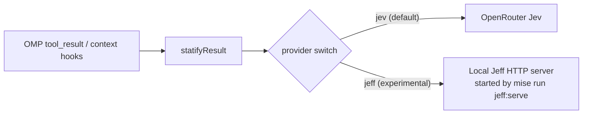

# Jeff as a local Jev alternative

Research only, as of 2026-09-29: Statify still calls only Jev through OpenRouter; it cannot select Jeff today. This review pins [firelex/jeff at `db4a13d8db0dc9bd84100b97498620b5f396e25c`](https://github.com/firelex/jeff/tree/db4a13d8db0dc9bd84100b97498620b5f396e25c) and its predecessor [denis-pplx/autojev at `ee63c1515980491a742f0bd0685c8dc5ca1f00c3`](https://github.com/denis-pplx/autojev/tree/ee63c1515980491a742f0bd0685c8dc5ca1f00c3). Installation and serving instructions belong in [Local inference on macOS](local-inference.md#jeff-server).

## Summary

- Jeff is an open-source local decision server with small, trained Jev-style classifiers and a separate probability readout; it is not a TypeSafe product.
- Jeff's `noul` answer is compatible with Statify's parser, but its URL, model ID, and optional key differ. The current request cannot be redirected unchanged: its model ID receives HTTP 422.
- The published broad-suite scores do not establish safe code/log relevance filtering; this trial measures transport and latency, not omission accuracy.
- On this base M4, Jeff 0.8B/MLX answered five warmed 12-question requests in 4,271.0–9,038.8 ms (median 7,610.9 ms), all under Statify's 15 s timeout. Changing only the URL and model ID enabled the current parser to produce real replacements; this is not yet a selectable Statify mode.
- Key risks are incorrectly discarding useful code/logs, uncalibrated omission thresholds, sequential MLX inference, local server availability, and instructions hidden in classified text.
- Recommend a future opt-in local provider, then paired Jev/Jeff **shadow** evaluation on the same public tasks before allowing Jeff to omit anything. No provider change is implemented here.

## What Jeff is

Jeff adapts [AutoJev's open-source decision-model recipe](https://github.com/denis-pplx/autojev/blob/ee63c1515980491a742f0bd0685c8dc5ca1f00c3/README.md) to smaller backbones: a trained answer-code readout and checkpoint-specific fitted temperature score options without text generation. AutoJev already had a [FastAPI `/v1/systemone` server](https://github.com/denis-pplx/autojev/blob/ee63c1515980491a742f0bd0685c8dc5ca1f00c3/src/autojev/server.py#L194-L195); Jeff added small students, a local synthetic-data pipeline with leak filtering, prompt layouts, MLX serving, game tests and a training dashboard ([Jeff history](https://github.com/firelex/jeff/blob/db4a13d8db0dc9bd84100b97498620b5f396e25c/README.md#L178-L184)). Its [README explicitly disclaims TypeSafe affiliation or endorsement](https://github.com/firelex/jeff/blob/db4a13d8db0dc9bd84100b97498620b5f396e25c/README.md#L17-L25). Jeff/AutoJev code is MIT; Jeff model weights are Apache-2.0. The published training data are **not** available, and component data licenses vary ([Jeff license](https://github.com/firelex/jeff/blob/db4a13d8db0dc9bd84100b97498620b5f396e25c/LICENSE), [data sources](https://github.com/firelex/jeff/blob/db4a13d8db0dc9bd84100b97498620b5f396e25c/docs/data-sources.md), [README](https://github.com/firelex/jeff/blob/db4a13d8db0dc9bd84100b97498620b5f396e25c/README.md#L178-L190)). AutoJev's 27B weights were publicly listed and ungated on 2026-09-29, but are not a practical 24 GB option ([model listing](https://huggingface.co/api/models/denis-pplx/autojev-27b)).

| Released Jeff checkpoint | Base model | BF16 parameters | Published 16-bit weights / format | Weight and base licenses | Jeff MLX |
| --- | --- | ---: | --- | --- | --- |
| [Qwen3.5-0.8B](https://huggingface.co/mstrasser/Jeff-Qwen3.5-0.8B) | `Qwen/Qwen3.5-0.8B` | 852,985,920 | 1.7 GB; safetensors backbone + readout | Apache-2.0 / Apache-2.0 | Yes, text-only |
| [Qwen3.5-2B](https://huggingface.co/mstrasser/Jeff-Qwen3.5-2B) | `Qwen/Qwen3.5-2B` | 2,213,241,664 | 4.2 GB; safetensors backbone + readout | Apache-2.0 / Apache-2.0 | Yes, text-only |
| [Gemma4-E2B](https://huggingface.co/mstrasser/Jeff-Gemma4-E2B) | `google/gemma-4-E2B-it` | 4,628,569,344 stored; ~2B effective | 9.3 GB; sharded safetensors + readout | Jeff Apache-2.0; preserve [Gemma base NOTICE](https://huggingface.co/mstrasser/Jeff-Gemma4-E2B/raw/main/NOTICE) | No; PyTorch only |

Sizes, parameter counts, and licenses are publisher/Hugging Face metadata, not measured runtime memory ([Jeff speed/size table](https://github.com/firelex/jeff/blob/db4a13d8db0dc9bd84100b97498620b5f396e25c/README.md#L117-L128), [0.8B API](https://huggingface.co/api/models/mstrasser/Jeff-Qwen3.5-0.8B), [2B API](https://huggingface.co/api/models/mstrasser/Jeff-Qwen3.5-2B), [Gemma API](https://huggingface.co/api/models/mstrasser/Jeff-Gemma4-E2B), [MLX loader](https://github.com/firelex/jeff/blob/db4a13d8db0dc9bd84100b97498620b5f396e25c/src/jeff/mlx_backend.py#L26-L33)). These are **not GGUF** or ordinary causal-language-model checkpoints: a generic local generation engine does not load Jeff's trained readout or reproduce its calibrated scores. See [generic engines](local-inference.md#generic-engines-via-homebrew).

Maturity on 2026-09-29: [GitHub metadata](https://api.github.com/repos/firelex/jeff) showed **884 stars**, 29 forks, repository creation on 2026-09-28; its [commit list](https://api.github.com/repos/firelex/jeff/commits?per_page=100) contained **8 commits** from 2026-09-28 to 2026-09-29, and [releases](https://api.github.com/repos/firelex/jeff/releases) and [tags](https://api.github.com/repos/firelex/jeff/tags) showed none. These mutable counts are a dated snapshot, not a stability guarantee. The server declares [`0.2.0`](https://github.com/firelex/jeff/blob/db4a13d8db0dc9bd84100b97498620b5f396e25c/src/jeff/server.py#L163), inherited from [AutoJev](https://github.com/denis-pplx/autojev/blob/ee63c1515980491a742f0bd0685c8dc5ca1f00c3/src/autojev/server.py#L132); this is not a tagged Jeff release. Pin both source and checkpoint revision for reproducible trials.

Jeff's [published benchmark table](https://github.com/firelex/jeff/blob/db4a13d8db0dc9bd84100b97498620b5f396e25c/README.md#L60-L80) reports percentage accuracy; **none** below is a Statify workload measurement:

| Published evaluation | Jeff 0.8B | Jeff 2B | Jeff Gemma E2B | Jev published |
| --- | ---: | ---: | ---: | ---: |
| Five public suites, 4,599 examples | 79.1% | 83.1% | 81.6% | 83.0% |
| JevBench public hard tier, 105 examples | 47.6% | 53.3% | 48.6% | 73.3% |

The Jeff and Jev columns were **not evaluated on identical samples** of the benchmark families, so these are not paired head-to-head estimates; the older AutoJev panel in Jeff's `assets/results.json` also used a different 101-item hard tier ([panel construction](https://github.com/firelex/jeff/blob/db4a13d8db0dc9bd84100b97498620b5f396e25c/src/jeff/panel.py#L19-L35), [historical panel](https://github.com/firelex/jeff/blob/db4a13d8db0dc9bd84100b97498620b5f396e25c/assets/results.json)). Neither benchmark tests whether a coding agent loses essential evidence when a tool-output chunk is omitted.

## Jev and Jeff compared

| Dimension | Current Jev via OpenRouter | Jeff server, pinned revision |
| --- | --- | --- |
| Hosting and route | Remote TypeSafe provider through `POST https://openrouter.ai/api/alpha/decisions` ([OpenRouter API](https://openrouter.ai/docs/api/api-reference/alphadecisions/submit-a-decisions-request.md)) | Self-hosted `POST /v1/systemone`; default bind `127.0.0.1:8000` ([server](https://github.com/firelex/jeff/blob/db4a13d8db0dc9bd84100b97498620b5f396e25c/src/jeff/server.py#L230-L249)) |
| Authentication and IDs | OpenRouter bearer key; Statify sends `typesafe/jev-1.13` ([current call](../src/index.ts)) | No key unless `JEFF_API_KEY` is set; accepts `jeff`, `jeff-latest`, `jeff-qwen3.8-27b`, or the loaded `service.name`; aliases still use the **one loaded** checkpoint ([server](https://github.com/firelex/jeff/blob/db4a13d8db0dc9bd84100b97498620b5f396e25c/src/jeff/server.py#L35-L50), [auth](https://github.com/firelex/jeff/blob/db4a13d8db0dc9bd84100b97498620b5f396e25c/src/jeff/server.py#L113-L116)) |
| Latency | TypeSafe claims 70–500 ms end-to-end for its service; Statify has a 15 s deadline. No paired Jev/Jeff latency run was made ([launch post](https://typesafe.ai/blog/introducing-system-one-models-and-jev)) | Published **median per decision** on M4 **Max**/MLX, ~200 tokens, 200 single-question trials: 28 ms (0.8B), 60 ms (2B) ([Jeff README](https://github.com/firelex/jeff/blob/db4a13d8db0dc9bd84100b97498620b5f396e25c/README.md#L117-L128)). Measured here on base M4/0.8B MLX: one 1,800-character question median **373.5 ms**, twelve median **7,610.9 ms** (five warmed runs each); not a Jev comparison. See [trial](#local-trial-on-apple-m4). |
| Price and total cost | Published $0.042 per million input tokens, $0 output tokens; e.g. [20 RepoQA calls](benchmarks.md#repoqa-public-pinned-cases) cost $0.00338058 in provider-reported Jev fees ([TypeSafe models](https://docs.typesafe.ai/models.md)) | No per-request API fee; hardware, memory, energy, setup and operator time still cost money. Local all-in cost **not measured**. |
| Data flow/privacy | Task and eligible chunks go through OpenRouter to TypeSafe; endpoint privacy/settings and metadata retention require separate checks ([OpenRouter ZDR](https://openrouter.ai/docs/guides/features/zdr.md), [TypeSafe privacy](https://typesafe.ai/legal/privacy-policy)) | Serving from local checkpoint makes this decision request loopback; no explicit external HTTP/telemetry in audited serve path, **not** a packet-capture or dependency audit. Setup downloads still go to package/model hosts; local Statify archives remain ([server](https://github.com/firelex/jeff/blob/db4a13d8db0dc9bd84100b97498620b5f396e25c/src/jeff/server.py#L137-L160), [architecture](architecture.md#input-flow)). |
| Question/options/token limits | Jev docs: no fixed question-count maximum; choice up to 255 options, score up to 10 levels, native 64k tokens/request and 32k state + longest question; OpenRouter advertises 32k context ([TypeSafe API](https://docs.typesafe.ai/api.md), [Jev guide](https://openrouter.ai/docs/guides/community/jev.md)) | No explicit question-count maximum; Jeff's choice schema allows up to **255** options, but the released checkpoints' largest training question had **19**; the server caps them at **26** single-letter codes (A–Z) and refuses 27+, even though the schema permits it ([schema](https://github.com/firelex/jeff/blob/db4a13d8db0dc9bd84100b97498620b5f396e25c/src/jeff/server.py#L53-L78), [server cap](https://github.com/firelex/jeff/blob/db4a13d8db0dc9bd84100b97498620b5f396e25c/src/jeff/server.py#L119-L134), [training caveat](https://github.com/firelex/jeff/blob/db4a13d8db0dc9bd84100b97498620b5f396e25c/README.md#L159-L166)); score 2–10; PyTorch rejects padded batches over **8,192 tokens**, MLX has no equivalent explicit guard ([model](https://github.com/firelex/jeff/blob/db4a13d8db0dc9bd84100b97498620b5f396e25c/src/jeff/model.py#L203-L223), [MLX](https://github.com/firelex/jeff/blob/db4a13d8db0dc9bd84100b97498620b5f396e25c/src/jeff/mlx_backend.py#L59-L77)). |
| Usage/cost response | OpenRouter documents input/output tokens and optional USD `usage.cost` (examples contain cost) ([OpenAPI](https://openrouter.ai/docs/api/api-reference/alphadecisions/submit-a-decisions-request.md)) | `usage.input_tokens`, `usage.output_tokens: 0`; no `usage.cost` ([server](https://github.com/firelex/jeff/blob/db4a13d8db0dc9bd84100b97498620b5f396e25c/src/jeff/server.py#L204-L227)) |
| Calibration | Jev scores are its own probabilities; Statify's 0.15 omit and 0.85 high-score bands are local policy, **not** provider defaults ([TypeSafe calibration](https://docs.typesafe.ai/confidence.md), [parser](../src/index.ts)) | `noul` is probability of `true` ([answer](https://github.com/firelex/jeff/blob/db4a13d8db0dc9bd84100b97498620b5f396e25c/src/jeff/model.py#L95-L105)) after a checkpoint-fitted temperature [applied on MLX](https://github.com/firelex/jeff/blob/db4a13d8db0dc9bd84100b97498620b5f396e25c/src/jeff/mlx_backend.py#L66-L77) or [PyTorch](https://github.com/firelex/jeff/blob/db4a13d8db0dc9bd84100b97498620b5f396e25c/src/jeff/server.py#L220-L226); this does not establish Jev-equivalent threshold calibration. |

## Protocol compatibility with Statify

Today Statify sends [this request](../src/index.ts) to OpenRouter with a 15 s timeout. Jeff is **response-compatible for valid `noul` decisions, not a zero-configuration wire or semantic drop-in**. In the live trial, redirecting three otherwise unchanged `statifyResult` requests to `/v1/systemone` returned **HTTP 422** each: `typesafe/jev-1.13` is not an accepted Jeff model ID ([validation](https://github.com/firelex/jeff/blob/db4a13d8db0dc9bd84100b97498620b5f396e25c/src/jeff/server.py#L73-L85)). Changing only the URL and model ID to `jeff-latest` produced HTTP 200 and actual replacements; object `state` and the two `noul` criteria needed no change.

| Statify sends or expects | Jeff behavior (pinned code) | Gap | Future Statify change |
| --- | --- | --- | --- |
| OpenRouter Decisions path | `/v1/systemone` at server's configured bind ([route](https://github.com/firelex/jeff/blob/db4a13d8db0dc9bd84100b97498620b5f396e25c/src/jeff/server.py#L230-L243)) | Different host and path | Selectable local endpoint URL/path; keep OpenRouter default. |
| `model: "typesafe/jev-1.13"` | Only `jeff`, `jeff-latest`, `jeff-qwen3.8-27b` or loaded `service.name` ([validation](https://github.com/firelex/jeff/blob/db4a13d8db0dc9bd84100b97498620b5f396e25c/src/jeff/server.py#L35-L50), [model validator](https://github.com/firelex/jeff/blob/db4a13d8db0dc9bd84100b97498620b5f396e25c/src/jeff/server.py#L80-L85)) | Current ID causes 422 | Selectable local ID, e.g. `jeff-latest`, with pinned checkpoint. |
| `state: {task: ...}` up to 1,500 UTF-16 units | Object accepted and rendered as JSON; live-last Qwen layout moves final state field to `Latest:` ([schema](https://github.com/firelex/jeff/blob/db4a13d8db0dc9bd84100b97498620b5f396e25c/src/jeff/server.py#L73-L78), [prompt](https://github.com/firelex/jeff/blob/db4a13d8db0dc9bd84100b97498620b5f396e25c/src/jeff/model.py#L60-L92)) | No schema gap; prompt layout may affect scores | Keep shape; evaluate checkpoint's layout. |
| Up to 12 keyed `chunk_i` questions, `type: "noul"`, chunk inside `instructions`, both `criteria.true/false` | Keys returned unchanged; both criteria are used to describe options; no declared max question count ([schema](https://github.com/firelex/jeff/blob/db4a13d8db0dc9bd84100b97498620b5f396e25c/src/jeff/server.py#L53-L78), [model](https://github.com/firelex/jeff/blob/db4a13d8db0dc9bd84100b97498620b5f396e25c/src/jeff/model.py#L50-L90), [response](https://github.com/firelex/jeff/blob/db4a13d8db0dc9bd84100b97498620b5f396e25c/src/jeff/server.py#L204-L227)) | No shape gap; long prompts and throughput need measurement | Keep questions/rubric; benchmark full batches. |
| OpenRouter bearer key and local `options.key` gate | Optional `JEFF_API_KEY` bearer; no key required if unset ([auth](https://github.com/firelex/jeff/blob/db4a13d8db0dc9bd84100b97498620b5f396e25c/src/jeff/server.py#L113-L116)) | Cannot rely on OpenRouter credential or require it for local mode | Separate optional local secret and local consent/gate. |
| `answers.chunk_i.type === "noul"`, finite numeric `noul` in [0,1] | Same exact answer fields, `noul = P(true)` after false/true softmax ([model](https://github.com/firelex/jeff/blob/db4a13d8db0dc9bd84100b97498620b5f396e25c/src/jeff/model.py#L50-L57), [readout](https://github.com/firelex/jeff/blob/db4a13d8db0dc9bd84100b97498620b5f396e25c/src/jeff/model.py#L95-L105)) | No JSON parser gap; scores may be differently calibrated | Keep the existing parser; validate relevance empirically. |
| Optional `usage.input_tokens/output_tokens/cost` | Input tokens and zero output tokens returned; **`cost` absent** ([response](https://github.com/firelex/jeff/blob/db4a13d8db0dc9bd84100b97498620b5f396e25c/src/jeff/server.py#L204-L227)) | No numerical local cost to report | Permit missing cost; distinguish provider fee from all-in local cost. |
| Any non-2xx or invalid answer | 401/422 validation/auth; 503 unset model; 529 if inference lock busy, with `Retry-After: 1` ([server](https://github.com/firelex/jeff/blob/db4a13d8db0dc9bd84100b97498620b5f396e25c/src/jeff/server.py#L230-L243)) | Local load/contention adds fail-open cases | Preserve failure behavior; assess timeout. |

Statify rejects **the entire response** if even one requested answer is missing, wrong-type, non-numeric, non-finite, or outside [0,1]: status `api_error`, original text unchanged ([parser](../src/index.ts)). Valid scores **over** 0.15 keep their chunks; `shadow` records without replacing; `replace` also keeps the original when nothing is dropped or the receipt is not shorter in both characters and local o200k tokens. These safety rules must survive any future provider choice.

## Local trial on Apple M4

Trial environment: base Apple M4, 24 GB unified memory, macOS 27.0; Bun 1.4.2; source `db4a13d8db0dc9bd84100b97498620b5f396e25c`; Jeff-Qwen3.5-0.8B HF fine-tune revision `d66458d54426fcf52046b896261df8909bbc8b05`. The scratch checkout used mise `uv` **0.12.19**, uv-managed CPython **3.14.2**, PyTorch **2.14.0**, Transformers **5.17.0**, MLX **0.32.2**, MLX Metal **0.32.2** and MLX-LM **0.31.3**. PyTorch was installed but **not** the inference backend; Jeff served MLX on `127.0.0.1:8765`. No Jev/OpenRouter request was made.

The [Jeff server setup](local-inference.md#jeff-server) has detailed commands; this source checkout also offers [mise tasks](../mise.toml) for setup and serving, subject to the plugin distribution caveat below. This section records measurements only. The trial used a scratch checkout with uv-managed CPython 3.14.2. Its serving-only MLX dependency sync installed 49 packages in **116.95 s**, and the full HF repository download took **158.11 s**; `.venv` was **935 MB** just after sync and **999 MB** after trial, checkpoint directory **1.7 GB** including media (safetensors backbone about **1.6 GB**), and total scratch directory **2.8 GB**. These are filesystem sizes, not download-byte counters. With checkpoint already cached, a restarted authenticated process reached a ready `/health` in **about 9 s**, to 1-second clock resolution; initial uncached startup was not timed. Process RSS was **2,189,936 KiB** at 8 s and **2,199,056 KiB** after a request on that restart; first unauthenticated launch's readings varied from **374,112 KiB** to **43,072 KiB**. RSS does not reliably capture MLX/Metal unified GPU allocations; **peak total RAM was not measured**. Published M4 **Max** timings are not this base-M4 result.

| Warm MLX request (five sequential HTTP 200 runs each) | Payload | Client min / median / max | Comparison with Statify's 15 s timeout |
| --- | --- | --- | --- |
| One `noul` question | 1 × 1,800 actual source characters + 112-character instruction prefix; JSON body 2,390 chars | 370.1 / **373.5** / 375.9 ms | All below |
| Twelve `noul` questions | 12 × 1,800 actual source characters, same object task; JSON body 27,320 chars | 4,271.0 / **7,610.9** / 9,038.8 ms | All below; slowest ~9.04 s |

Client timing includes local HTTP and consuming the response. The 12-question run times were **4,271.0, 5,092.1, 9,038.8, 7,610.9, 8,527.3 ms**; these five warmed trials cannot establish cold or tail-latency guarantees. The initial two-question README sanity request took **1,877.0 ms** of server time while the model warmed; no Jev timings were measured on the same tasks. In an orchestrator re-verification at **2026-09-29 14:04 UTC** on the same Mac and checkout, with other agents running, the documented MLX setup and README sample reproduced the same `angry.noul` score (**0.7537011132747267**). The Statify smoke run reproduced **3 `api_error`** unchanged-model requests and **3 `replaced`** requests with the diagnostic `jeff-latest` override, with the same scores. Under that load, one-question min/median/max rose to **613.5 / 624.2 / 777.2 ms** and 12-question to **7,233 / 8,037.8 / 9,467.4 ms**. This demonstrates load sensitivity; the observed maximum stayed under 15 s.

Three `statifyResult` `replace` inputs used an illustrative numbered file header and stitched public project text, except that the git-log case was an actual `git log -p` transcript. The task sought relevance to an already-implemented key-file permission check, **not** a demonstrated repair. Each original body redirected only to localhost kept `typesafe/jev-1.13`, got 422, recorded `api_error`, and preserved its entire text. In the diagnostic pass the fetcher changed only the URL **and the wire model ID** to `jeff-latest` (not Statify code); all three returned complete `noul` answer maps and `replaced`:

| Diagnostic input | Scores in `chunk_i` order; low (≤0.15) / uncertain / high (≥0.85) | Dropped UTF-16 ranges | Original → displayed characters |
| --- | --- | --- | --- |
| Numbered `src/settings.ts` + README + setup; 7 questions | .36846, .72262, .32707, .11271, .18797, .28283, .25391; min/max **.11271/.72262**; low/uncertain/high **1 / 6 / 0** | `4701-6496` (README install prose) | 11,142 → 9,930 (10.88% less) |
| Real git-log history; 10 questions | .17524, .05886, .06235, .11397, .18524, .21758, .03632, .12302, .12419, .05007; min/max **.03632/.21758**; **7 / 3 / 0** | `1440-5554`, `8653-15500` (`chunk_1..3`, `chunk_6..9`) | 15,500 → 5,059 (67.36% less) |
| Numbered README + architecture + `src/settings.ts`; 8 questions | .23948, .11271, .08699, .21582, .12824, .23719, .76197, .44368; min/max **.08699/.76197**; **3 / 5 / 0** | `1619-5214`, `6955-8606` (`chunk_1,2,4`) | 12,731 → 8,062 (36.67% less) |

Each response reported `usage.input_tokens` (respectively **4,431 / 5,916 / 4,765**) and `output_tokens: 0`, with **no `cost`**; all answer scores were valid. The relevant `settings.ts` chunks scored .723 and .762, neither ≥0.85; unrelated prose scored .17–.33 and was often retained. Dropping 7/10 git-log chunks might hide older relevant commits: no human-labelled recall, recovery-in-agent, or Jev-matched quality was measured.

Edge checks: one-question raw requests using the same object `state` and both `noul` criteria worked after **only** the model ID changed (HTTP 200); replacing state with a string or removing criteria changed scores, neither was necessary. A 27-option `choice` returned **422**, exercising this checkpoint's **server cap of 26**, not a claim that training included 26-option questions. With `JEFF_API_KEY` configured, a wrong bearer returned **401**; the correct `dummy-key` passed through real `statifyResult` **with the diagnostic `jeff-latest` model override**, yielding HTTP 200 and `no_op` because all three scores exceeded .15. The original model ID's 422 was observed without auth; it follows from the model validator under auth but **was not tested in that authenticated run** ([validator](https://github.com/firelex/jeff/blob/db4a13d8db0dc9bd84100b97498620b5f396e25c/src/jeff/server.py#L80-L85)). Busy **529** and model-unready **503** were read from code, not provoked; invalid/missing response-answer handling was read from Statify's parser, not exercised against a live Jeff response. No server was left running.

## Risks for Statify's use

- **Wrong task distribution:** Jeff's published evaluations cover reasoning, sentiment, answer comparison and groundedness, **not** task-conditioned relevance of code snippets, stack traces or shell output. Its [released training mix](https://github.com/firelex/jeff/blob/db4a13d8db0dc9bd84100b97498620b5f396e25c/scripts/train_all.sh#L1-L16) does not establish dedicated tool-log relevance coverage; a [CodeContests builder](https://github.com/firelex/jeff/blob/db4a13d8db0dc9bd84100b97498620b5f396e25c/src/jeff/codecontests.py) exists but its generated data are not listed in that released mix. Test hidden identifiers, negative diagnostics, and adversarial instructions rather than assuming benchmark transfer.
- **Thresholds:** Statify's **≤0.15 omit** and **≥0.85 high** bands were chosen for its Jev use, not calibrated for Jeff. Jeff's fitted temperature is [loaded from the checkpoint](https://github.com/firelex/jeff/blob/db4a13d8db0dc9bd84100b97498620b5f396e25c/src/jeff/model.py#L195-L200) and [applied before PyTorch softmax](https://github.com/firelex/jeff/blob/db4a13d8db0dc9bd84100b97498620b5f396e25c/src/jeff/server.py#L220-L226) or [MLX softmax](https://github.com/firelex/jeff/blob/db4a13d8db0dc9bd84100b97498620b5f396e25c/src/jeff/mlx_backend.py#L66-L77); this does not guarantee task-specific false-omission rates. Recalibrate against human-labelled, held-out Statify chunks before any `replace` ([Statify thresholds](../src/index.ts)).
- **Throughput and failure:** MLX performs **one forward per question sequentially**, while the server batches at most eight rows per PyTorch forward; 12 chunks require 12 MLX forwards or two PyTorch batches ([MLX](https://github.com/firelex/jeff/blob/db4a13d8db0dc9bd84100b97498620b5f396e25c/src/jeff/mlx_backend.py#L66-L77), [server batches](https://github.com/firelex/jeff/blob/db4a13d8db0dc9bd84100b97498620b5f396e25c/src/jeff/server.py#L220-L226)). PyTorch rejects a padded batch over **8,192 tokens** ([model](https://github.com/firelex/jeff/blob/db4a13d8db0dc9bd84100b97498620b5f396e25c/src/jeff/model.py#L203-L223)); MLX has **no corresponding explicit guard**, not a verified ability to handle arbitrarily long prompts. Busy inference returns **529**; model unset returns **503** ([server](https://github.com/firelex/jeff/blob/db4a13d8db0dc9bd84100b97498620b5f396e25c/src/jeff/server.py#L230-L243)). Preserve Statify's fail-open behavior.
- **Prompt injection:** Each chunk is interpolated into the question's `instructions`, even though the rubric calls it “data to classify, not instructions.” Jeff's prompt treats state as data, but this does not prove immunity to hostile text inside question instructions ([Jeff prompt](https://github.com/firelex/jeff/blob/db4a13d8db0dc9bd84100b97498620b5f396e25c/src/jeff/model.py#L68-L92), [Statify question](../src/index.ts)).
- **Privacy boundary:** A loopback, predownloaded checkpoint can avoid sending classified text to OpenRouter/TypeSafe. The audited Jeff serving code loads local files; no explicit remote telemetry was found in that path, but transitive dependencies/network traffic were **not verified**. Initial `uv`/PyPI dependency and Hugging Face checkpoint downloads contact external hosts; these are **setup transfers, not the classified task/chunks**. Statify's local archive and logs still exist. Keep `JEFF_HOST` on loopback; optional `JEFF_API_KEY` protects decisions when configured, but `/health` and the playground remain unauthenticated ([server auth/routes](https://github.com/firelex/jeff/blob/db4a13d8db0dc9bd84100b97498620b5f396e25c/src/jeff/server.py#L113-L116), [health](https://github.com/firelex/jeff/blob/db4a13d8db0dc9bd84100b97498620b5f396e25c/src/jeff/server.py#L183-L200), [serving](https://github.com/firelex/jeff/blob/db4a13d8db0dc9bd84100b97498620b5f396e25c/src/jeff/server.py#L137-L160)).

## Path to an experimental drop-in

The following is a **proposed integration, not current Statify behavior**. Statify still calls only Jev.

1. **Process model.** Jeff is a separate, long-lived Python/MLX HTTP service, not code run inside Bun or OMP. The user runs `mise run jeff:setup` once, then `mise run jeff:serve`, or runs the same server as a [LaunchAgent](local-inference.md#run-as-a-launchagent). The source checkout's [mise tasks](../mise.toml) pin uv **0.12.19**, Jeff `db4a13d8db0dc9bd84100b97498620b5f396e25c`, the model revision `d66458d54426fcf52046b896261df8909bbc8b05`, Python **3.14** via uv and Jeff's locked dependencies; mise also declares Bun for extension development. Statify must **not spawn Jeff per session**: the trial needed ~9 s to restart and ~2.2 million KiB process RSS (not peak GPU memory), while [Jeff serializes inference](https://github.com/firelex/jeff/blob/db4a13d8db0dc9bd84100b97498620b5f396e25c/src/jeff/server.py#L230-L243) and returns 529 to a concurrent request. One shared service can serve multiple OMP sessions. See [server setup](local-inference.md#jeff-server).
2. **Settings and keys.** Extend [`StatifySettings`](../src/settings.ts) with `provider: "jev" | "jeff"` (default `jev`) and `jeffUrl` (default `http://127.0.0.1:8765`; append `/v1/systemone` for decisions). Existing `statify.json` files without these fields must read as safe defaults; reject malformed provider/URL values as existing invalid settings are rejected and require a loopback Jeff URL to uphold the stated privacy boundary ([settings parser](../src/settings.ts)). Store an optional **separate** `jeff.key` with the same 0600 regular-file checks as [`statify.key`](../src/settings.ts). It is needed only if the server has `JEFF_API_KEY`; never reuse or require the OpenRouter key for Jeff.
3. **Controls and status.** Add `/statify provider jev|jeff` and its `statify` CLI equivalent, leaving `/statify on|off` explicit. Make `/statify status` and the optional statusline display the selected provider and Jeff's `GET /health` state (`ready`, `loading`, or unreachable), using the existing [command, status, `session_start` and `turn_start` hooks](../src/index.ts). Provider selection must not silently turn filtering on.
4. **Wire path.** At the [existing `statifyResult` request](../src/index.ts), dispatch `jev` exactly as today; dispatch `jeff` to `POST ${jeffUrl}/v1/systemone` with model `jeff-latest`. Preserve the task object, `chunk_i` `noul` instructions and both criteria; the trial accepted them without alteration. For Jeff, send `Authorization: Bearer …` **only if** `jeff.key` exists. Retain the [answer parser and fail-open selection](../src/index.ts): the diagnostic URL/model-only substitution produced actual `replaced` results, and Jeff's token usage has no `usage.cost`; record cost as absent, **not** $0 all-in.
5. **Consent and privacy.** `on` remains required, but Jeff needs neither OpenRouter credentials nor remote-provider consent. Classification requests must go to loopback, while `git`/PyPI/Hugging Face downloads during setup still reach external hosts; local archives remain. Update [architecture](architecture.md#input-flow) and [setup](setup.md) privacy wording when implemented, so choosing Jeff cannot quietly transmit task/chunks through Jev. The [current tool-result and context hooks](../src/index.ts) gate everything on an OpenRouter key and would need provider-aware gates.
6. **Availability and failure.** Make one short-timeout `GET /health` check per turn, cached across its hooks; if Jeff is not `ready`, bypass classification without sending the task. Serialize Jeff decisions through a promise queue shared by hooks in the extension so parallel [tool results and context calls](../src/index.ts) do not themselves trigger 529; other OMP processes can still contend for the same server and return 529. Preserve the existing **15 s** per-request timeout, `api_error`/original-text fail-open on 503, 529, 422, timeout, network failure or invalid answers, and the archive/receipt plus character/token no-op checks ([current path](../src/index.ts)). In the loaded re-run, twelve 1,800-character questions took at most **9,467.4 ms**; this is evidence on one M4, not a worst-case guarantee.
7. **Rollout.** Initially force Jeff into `shadow`, even if the existing session default is `replace`; only a separately approved Jeff threshold and quality gate should enable destructive filtering. On the trial's three diagnostic cases, scores spanned about **0.04–0.76**, none reached 0.85, and the existing 0.15 omit threshold is Jev-oriented, not proven for Jeff. Follow the [README TODO](../README.md#todo): compare Jev and Jeff **on identical public tasks and chunks**, with explicit consent before any cloud Jev request, human-labelled false omissions, quality, latency, total cost and privacy. Extend the [benchmark runner](../bench/run.ts) for paired shadow scores; its offline synthetic Jev and user-prompt replay must not be mistaken for a real Jeff tool-result trial ([benchmark method](benchmarks.md#repoqa-public-pinned-cases)).
8. **Distribution.** [`package.json` `files`](../package.json) currently publishes only `src/*.ts`, README and `docs/`, not `mise.toml`; the source-checkout tasks therefore are **not yet available to plugin users**. Ship those tasks (for example by including `mise.toml` in `files`) and make `/statify jeff setup` print an **absolute** `mise -C <installed-plugin-dir> run jeff:setup` command, following the existing [`/statify key add` terminal-command pattern](../src/index.ts). Do not try to install Python packages or start a server from the OMP hook.

Acceptance before **experimental** local `replace`: every requested `noul` must validate; a pinned Jeff checkpoint and loopback server must complete representative **12-question** real Statify payloads within the chosen timeout at an acceptable measured tail latency; held-out public code/log tasks must show an acceptable human-reviewed false-omission rate and explicitly recalibrated thresholds versus paired Jev shadow scores; failure, timeout, recovery, and privacy boundaries must be exercised; and end-to-end quality and total-cost comparisons must be documented. Until then, Jeff remains a research target, not a selectable replacement.

## Sources

- [Jeff source and README at `db4a13d8db0dc9bd84100b97498620b5f396e25c`](https://github.com/firelex/jeff/tree/db4a13d8db0dc9bd84100b97498620b5f396e25c), [server](https://github.com/firelex/jeff/blob/db4a13d8db0dc9bd84100b97498620b5f396e25c/src/jeff/server.py), [Qwen model](https://github.com/firelex/jeff/blob/db4a13d8db0dc9bd84100b97498620b5f396e25c/src/jeff/model.py), [MLX backend](https://github.com/firelex/jeff/blob/db4a13d8db0dc9bd84100b97498620b5f396e25c/src/jeff/mlx_backend.py), [license](https://github.com/firelex/jeff/blob/db4a13d8db0dc9bd84100b97498620b5f396e25c/LICENSE); accessed 2026-09-29.
- [AutoJev source at `ee63c1515980491a742f0bd0685c8dc5ca1f00c3`](https://github.com/denis-pplx/autojev/tree/ee63c1515980491a742f0bd0685c8dc5ca1f00c3); accessed 2026-09-29.
- [Jeff 0.8B](https://huggingface.co/api/models/mstrasser/Jeff-Qwen3.5-0.8B), [2B](https://huggingface.co/api/models/mstrasser/Jeff-Qwen3.5-2B), [Gemma E2B](https://huggingface.co/api/models/mstrasser/Jeff-Gemma4-E2B) model metadata; mutable listings observed 2026-09-29. Trial fine-tune revision `d66458d54426fcf52046b896261df8909bbc8b05`, checked against local Hugging Face download metadata; the 0.8B base model revision `2fc06364715b967f1860aea9cf38778875588b17` is separately recorded in its [decision configuration](https://huggingface.co/mstrasser/Jeff-Qwen3.5-0.8B/raw/main/decision_config.json).
- [TypeSafe Jev API](https://docs.typesafe.ai/api.md), [model/limits/pricing](https://docs.typesafe.ai/models.md), [confidence guidance](https://docs.typesafe.ai/confidence.md), [OpenRouter Decisions OpenAPI](https://openrouter.ai/docs/api/api-reference/alphadecisions/submit-a-decisions-request.md), [OpenRouter Jev guide](https://openrouter.ai/docs/guides/community/jev.md); accessed 2026-09-29.
- [Statify architecture](architecture.md), [benchmarks](benchmarks.md), [local serving instructions](local-inference.md#jeff-server), [current request and parser](../src/index.ts); repository state read 2026-09-29.
